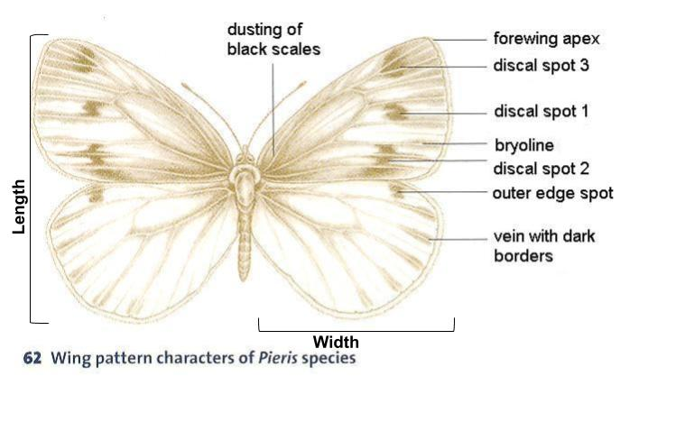
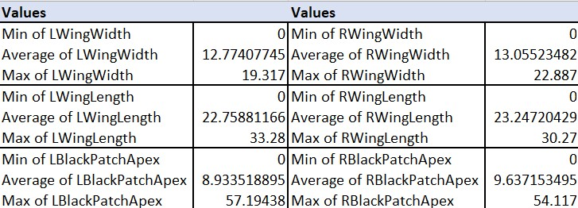
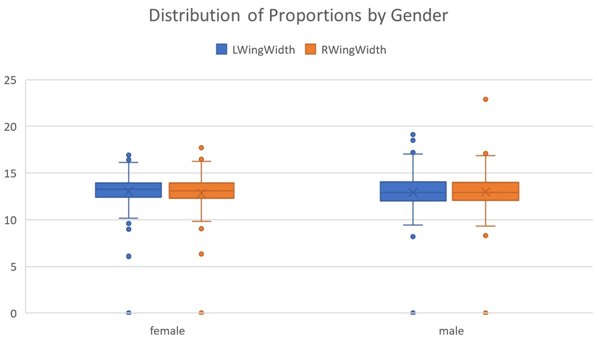
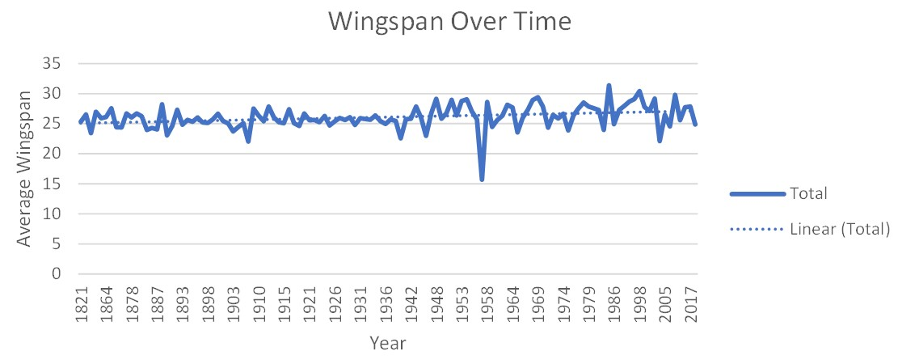

# Butterfly Data: Change in Wing Proportions Over Time
## Introduction
The butterly data set contains information concerning observtions on the Pieris rapae butterly. Measurements of various propotions are included as well as the year those observations were made for each specific sample. This analysis examines change in wing proportions (length, width, and apex size) over time. This report will also supply information concerning statistics about the data as a whole, as well as steps taken to clean the data. The proportions analyzed in this report are limited to wing length, wing width, and black patch apex.

For reference, below is a labeled chart of a butterfly:

## Data Cleaning
In order for the data to be analyzed and produce meaningful data, it must be cleaned to ensure consistency. The following data cleaning steps were taken on this data set: 
1. Modify SexUpdated column so that it only contained male, female, or unknown/blanks
2. N/A values of any numerical proportion column changed to 0
3. Ensured all values in YearUpdated were in a consistent year format

We also elected to only use the raw data, and not the smaller "cleaned" data set. 

## Statistics About Data

The above statistics show the min, average, and max for the three analyzed columns. This is important because it shows the distribution of proportions. Note. See below for a visual representation. Just by looking at this graph, we can see that each wing is roughly the same size. However, the right wing, on average, is slightly larger than the left. 

## Distribution
Below is a visual representation of proportion size by gender of both the right and left wings. 

By looking at this visual, it can be immediately seen that on average, wing proportions are similar regardless of gender. Insterestingly however, for males, the box and whiskers (containing almost all of the data) is slightly larger, as well as the max value. This implies that males have a slight variation in wing size either smaller, or larger.

Below shows the distribution or wing span for both sexes. Wingspan is calculated as the width of the right wing plus the width of the left. 

This chart highlights that the wingspan of the Pieres rapae species of butterfly is roughly normally distributed around the mean (about 13). It also highlights several possible outliers/incorrect data in the bin that includes 0. Our data cleaning involved changing empty data to zeros, so that bin serves as a way to visualize how much data was missing. Looking back at the distribution of wingspan, we can see that on average, a wingspan is relatively predictable and will fall within the middle range of this distribution. 

## Visualizations and Analysis
Below is a visualization of wingspan evolution over time from 1821 to 2017. 

The first noticable feature of this graph is a drastic decrease in wingspan in the late 1950s. On further investigation, there is only a single record during the year 1958, which skews the data to appear that there was a drop in wingspan during that time. On the contrary, the data as a whole generally follows an upward trend in increasing wing span over time from past to presest. It is likely that this trend will continue in the future. 

Below shows a breakdown of wingspan over time by gender from 1821 to 2016. 

Interestingly, by breaking down wingspan evolution over time by the sex of the specimen, it tells an interesting story. The wingspans do not always vary at the same time. For example, between 1889 and 1924, the genders appear to be almost opposite of the other at any given time. It is not until the mid 19th century that they begin to change at a similar pace. Arguably, each line does seem to trend upwards, however not consistent with the other sex. 

The graph below highlighs information about the apex of each specimen.

Initial assumtions were that the apex on each wing would be similar. Over time, the variation in the size of the apex patch, regardless of wing it is on was nearly identical. However, the average of the left apex patch was consitently larger than that of the right. Interestingly, the left patch is 10-15mm larger than that of its right counterpart. Perhaps this has something to do with mating patterns or other evolutionary events. 

## T-test
Our T-test analysis was done in R to determine if there was a significant difference between the means of two groups. We did a t test on right nd left wing length and also right and left wing width. The results are below: 

RWingLength and LWingLength T-Test Results: 
T-stat: 100.45
P-value: 2.2e-16
Confidence Interval: [10.03957, 10.43972]
Mean of differences: 10.23964

RWingWidth and LWingWidth T-Test Results: 
T-stat: 112.77
P-value: 2.2e-16
Confidence Interval: [9.978191, 10.331461]
Mean of differences: 10.15482

The p-value of the wing length test, 2.2e-16 is less than the significance level alpha (0.05), which allows us to conclude that the right with legnth average is significantly different from the left wing length. The T-test for wing width shows an identical p-value which allows us to reach the same conclusion of the wing length results. 

## Summary
This analysis focused primarily on wing proportions over time both by gender and as an entire sample population. The general trend of the data showed increase in win glength, width, and apex spot size over time. In doing this project, we ran into many issues and dealt with a variety of miscalculations and failures. During exploratory data analysis, we found many anomolies and outlier that needed to be fixed ranging from sample size of a year being to small to having inconsistent naming ocnventions for the sex of each sample. For future use, this analysis can be duplicated or added onto new data sets which will likely show a further increase in wing proportions over time. Further, better data collection methods should be put in place to allow better analysis of the provided data. 