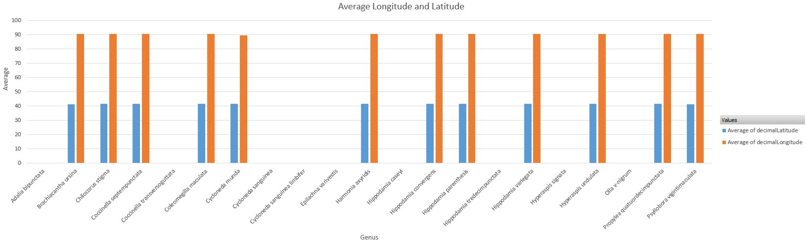
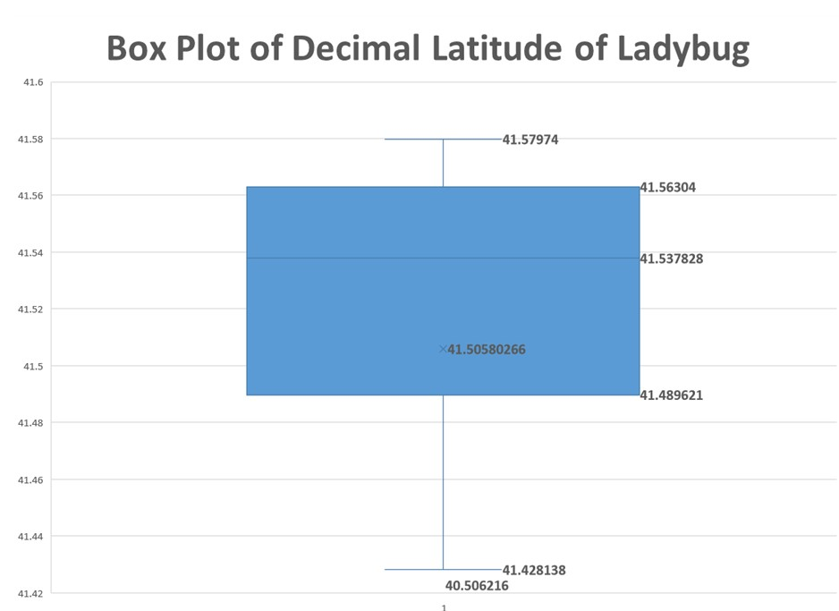
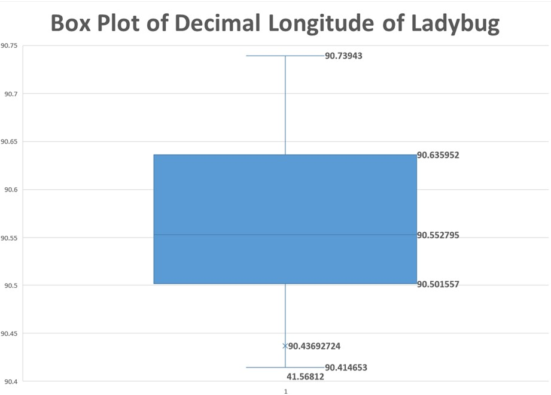
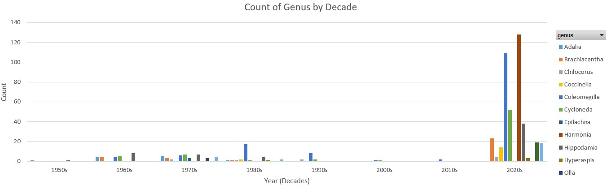

# Ladybug Data: Examining Geographical Location of Samples
## Introduction
The ladybug data sets contain information concerning observtions on several ladybug species. Aside from a unique ID, features for each sample include the date collected as well as geographical information such as longitude, latitude, country, and state (if available). This analysis focuses on examining both the geographical distribution of samples in the data set, as well analyzing species popultations over time. 

## Data Cleaning
In order for the data to be analyzed and produce meaningful data, it must be cleaned to ensure consistency. The following data cleaning steps were taken on this data set: 
1. 

## Statistics About Locations in the Data

What we see below is a representation of the average latitude as well as the average longitude of the different species of ladybug based on its scientific name.

Looking at this chart, it can be seen that the average longitude of most of the species are similar, excluding the decimal differences. From this, we can understand that a variety of species, that are categorized as ladybugs, are located at the northern part of the US. On the other hand, the average latitudes tell us that these species are most likely to be found on the east as well as the west side of the Midwest.      

The boxplot below represents the latitudanal difference among the species.

These species of ladybugs can be found at the lowest of 41.28138 degrees, the highest of 41.57974, and at the mid-point of 41.537828. The interquartile range of 0.073419 tells us that the dataset is less spread out. Although the data has one outlier of 40.506216, this signifies that the dataset is less spread out and that it has a reliable consistency for further study. It can also be seen that the boxplot is negatively skewed. This tells us that the data consists of high frequency of high value score.

The boxplot below represents the longitudanal difference among the species.

These species of ladybugs can be found at the nearest of 90.414653 degrees, the farthest of 90.73943, and at the mid-point of 90.552795. The interquartile range of 0.134363 tells us that the dataset is less spread out. Although the data has one outlier of 90.46392724, this signifies that the dataset is less spread out and that it has a reliable consistency for further study. It can also be seen that the boxplot is positively skewed. This tells us that the data consists of high frequency of low value score.
 
## Visualizations and Analysis
Include the map here

Below is a visual of the number count of genuses of ladybugs by decade from 1956 till 2021. 

Looking at the line chart above, it can be seen that there was a significant increase in the number genuses during 2021 while there were merely a few number of genuses that were found from the '50s. This could have been due to the environmental aftermath of World War II. During the 1960s and 1970s, there were merely about 2 genuses of ladybugs that existed. This could have been due to the mass industrialization that had occurred in the US. Looking at a slight uprise around the 1980s, it is evident that the rise in environmental awareness in the US could have caused the impact. However, with the increasing pollution and environmental degradation that occurred after the 2000s, the number of genuses decreased significantly. Apart from that, it is unfathomable to explain the cause of their low count until the 2020s. 

## T-test

NEED A WRITE UP

## Summary and Conclusion
From this data, we can conclude that the samples collected and analyzed were taken from a limited geographical location. Further, the samples collected are more prevalent in recent decades as compared to older in time. From this data, we learned that there are a variety of ladybug genus located in the midwest, however the limited sample size may not be representative of the population for each genus not only in the midwest, but especially in other parts of the country or world where these species exist. An initial problem faced in this analysis was working with R and excel to create a map of where a genus is located. We also struggled to find a use for combining the datasets given, so ultimately we decided to analyze the genus in just one of the datasets. 
